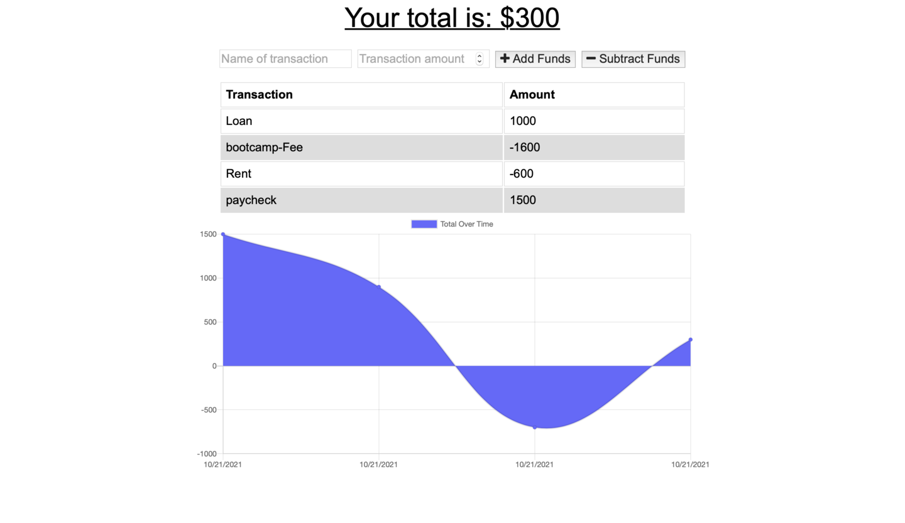
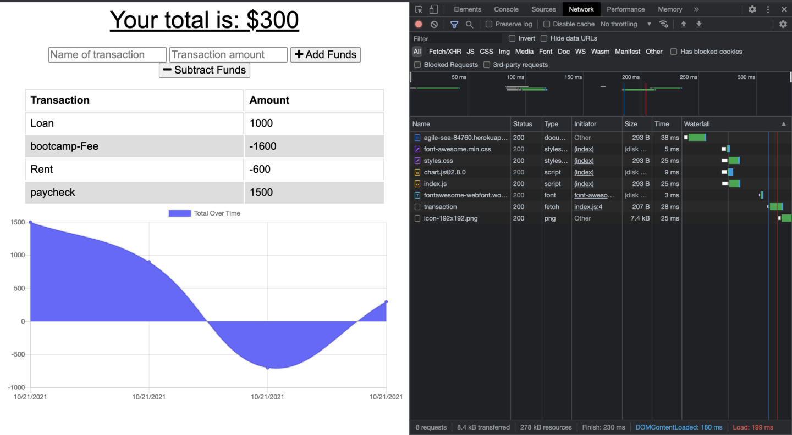
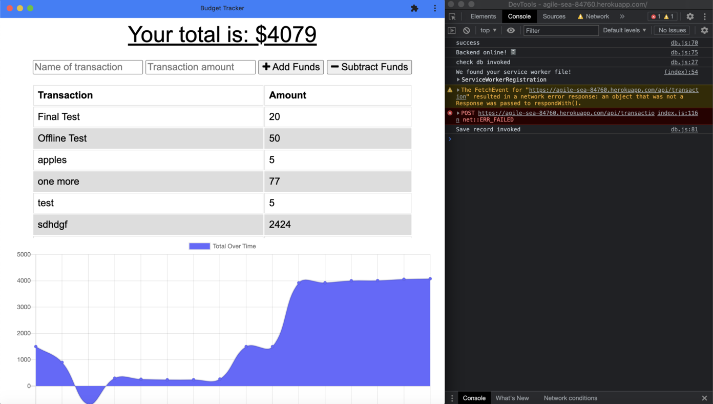
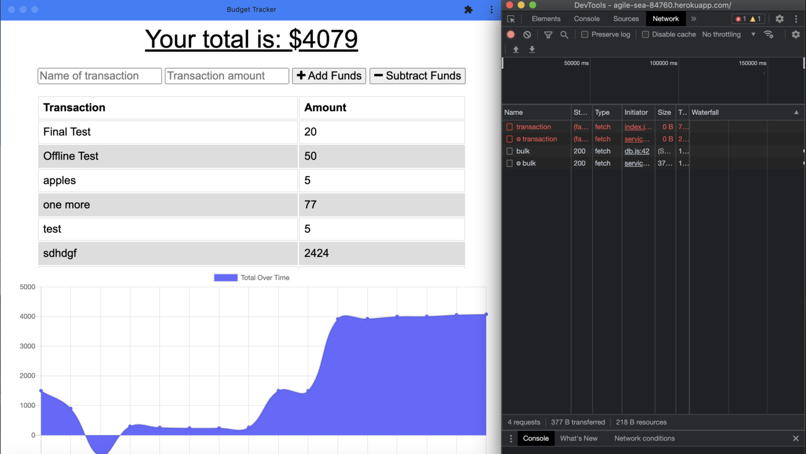

# Online/Offline Budget Trackers

# Description

This app will let user to add expenses and deposits to their budget with or without a connection. When entering transactions offline, they should populate the total when brought back online.

## Technologies

- [Mongoose](https://www.npmjs.com/package/mongoose) It manages relationships between data, provides schema validation, and is used to translate between objects in code and the representation of those objects in MongoDB.
- [Morgan](https://www.npmjs.com/package/morgan) It is a logging tool(middleware) which is use in HTTP servers implemented using Express & Node.js.
- [Compression](https://www.npmjs.com/package/compression) It increases the performance of application by reducing the documents size up to 70%.
- [express.js](https://www.npmjs.com/package/express) It allows to define routes of application based on HTTP methods and URLs.
- [Node.js](https://nodejs.org/en/docs/) It address bulk requests that are handled through callback functions to ensure quality and quantity.
- [MongoDB](https://www.mongodb.com) It stores data with dynamic schema which provides high performance, high availability, and automatic scaling.

## Deployed Vercel Link:

### [Online/Offline Budget Trackers](https://new-budget-tracker.vercel.app/)

# Screenshots:

## Budget Tracker App's overview:



## Online functionality:



## Offline functionality:

```

  Enter deposits offline

  Enter expenses offline

```



## When brought back online:

```
   Offline entries added to tracker.
```



## Links :

- Link for the deployed application in Vercel [Online/Offline Budget Trackers](https://new-budget-tracker.vercel.app/)
- Link for the Github repository [Host by Github](https://github.com/Rajesh295-dev/budgetTracker)

## Contributor:

- [Rajesh Gautam](https://github.com/Rajesh295-dev)
- E-mail: rajeshgautam766@gmail.com

---
